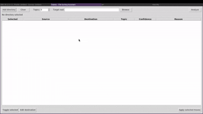

<table>
<tr>
<td></td>

<td style="vertical-align: top; font-size:12px;">
<pre style="margin:0; white-space: pre-wrap;">
$ ./themis

THÉMIS 2.4

Source folders:
Target: default
Plan rows: 6354
Learn from target: yes | Train Bayes after moves: yes
Bayes memory: ~/themis_bayes_memory.jsonl

1 Add source folder
2 Add already sorted training folder
3 Clear source folders
4 Set destination / existing sorted folder
5 Settings
6 Analyze / build plan
7 Review/edit plan
8 Learned categories
9 Apply selected moves
10 Exit

$ Choice:
</pre>
</td>

</tr>
</table>

# Thémis

**Private, secure, low-resource file sorting assistant powered by a self-learning local algorithm.**

Themis is a cross-platform software that helps users reorganize files on their own computer. It analyzes file names, proposes a new folder structure, shows the proposed changes before anything is moved, and lets the user edit categories before applying the plan.

The project originally worked as an **LDA-only topic-based sorter**. The current version keeps LDA as the first discovery layer (1.0), but adds a **local Naive Bayes learning layer** (2.1). This means Themis can now improve over time from the categories approved by the user, without uploading files, file names, or training data to any external service. 

https://github.com/user-attachments/assets/4b41e0ab-2acd-4270-9455-aa58cd244ce1

<!--https://github.com/user-attachments/assets/44b5669c-3250-43cf-8b42-4c517721a8e5-->
>2.4 update note : This improves both the graphical interface and the terminal/C++ workflow with a stronger, more persistent Bayes training system. Bayes now keeps a local memory file, themis_bayes_memory.jsonl, next to the launcher or executable, and can be trained from an already sorted folder without moving any existing files. The destination folder can also be used as a training source during analysis, making it easier to add unsorted files into an existing sorted repository. The move history is now always written to themis_history.jsonl, while Bayes training can be enabled or skipped independently for each move. The interface also adds clearer controls, safer text wrapping, and dedicated Import plan / Export plan buttons for CSV plans. The CLI and C++ TUI were updated to match the same 2.4 behavior, including optional Bayes training, persistent memory, sorted-folder training import, and consistent plan import/export support.

## Contents

- [Status](#project-status-at-a-glance)
- [Features](#what-themis-does)
- [Workflow](#core-workflow)
- [Install](#installation-from-source)
- [Usage](#gui-usage-tutorial)
- [C++ Interface](#c-usage-tutorial)
- [CLI](#python-cli-usage-tutorial)
- [Build](#build-and-compile-guide)
- [License](#license)

---

## Project Status At A Glance

| Property | Meaning |
|---|---|
| Name | **Themis** |
| License | **GNU Affero General Public License** |
| Privacy model | **Local-first**. File names, paths, categories, and training history stay on the user’s machine. |
| Network use | No network connection is required for normal use. |
| Data sent to third parties | None by design. |
| Main input | File names and paths selected by the user. |
| Main output | A proposed file-moving plan and, after confirmation, moved files. |
| Destructive operations | No deletion is performed by design. |
| Default behavior | Preview-first: Themis proposes a plan before moving files. |
| Original algorithm | Lightweight LDA-inspired topic model over file-name tokens. |
| Current algorithm | Hybrid workflow: LDA discovers initial groups, then local Naive Bayes takes over when enough approved training history exists. |
| Training model | Local, incremental-by-history training from user-approved categories stored in `themis_history.jsonl`. |
| Resource usage | Lightweight. It uses file-name tokens, not full file contents. |
| Cross-platform | Windows, macOS, and GNU/Linux. |
| Interfaces | GUI and CLI. |
| Target users | People who want to reorganize local folders safely and privately. |

---

## Meaning Of The Name

**Thémis** is named after **Themis**, the ancient Greek personification of divine order, law, fairness, and proper arrangement.

The name was chosen because the software’s purpose is to restore order in chaotic folders.

---

## What Themis Does

Themis helps sort local files by analyzing their file names.

For example, a folder containing:

```text
invoice_client_alpha_2025.pdf
invoice_client_beta_2024.pdf
holiday_family_photo.jpg
project_report_ai.docx
meeting_notes_budget.txt
```

may be reorganized into folders such as:

```text
Themis_Sorted/
  invoices/
    invoice_client_alpha_2025.pdf
    invoice_client_beta_2024.pdf
  photos/
    holiday_family_photo.jpg
  reports/
    project_report_ai.docx
  meetings/
    meeting_notes_budget.txt
```

At the very beginning, Themis may create LDA-style topic folders such as:

```text
Themis_Sorted/
  01_invoice_client_2025/
  02_photo_holiday_family/
  03_project_report_ai/
```

After the user reviews and approves categories, the local Bayes model learns from that history. Future scans can then use clearer user-defined categories such as:

```text
invoices
photos
reports
meetings
courses
archives
```

---

## What Themis Does Not Do

Themis does not:

- read the full content of files;
- upload files to a server;
- require an online account;
- train a remote model;
- send file names, paths, or categories to third parties;
- delete files;
- guarantee perfect classification;
- replace human validation;
- understand private business context unless that context appears in file names or approved categories;
- decrypt, inspect, or modify document contents.

The program is designed as a local assistant, not as an autonomous document manager.

---

## Core Workflow

Themis follows a review-first workflow.

```text
Select folders
↓
Scan file names
↓
Tokenize names
↓
Run LDA discovery model
↓
Load local Bayes history if available
↓
Use Bayes when trained and confident
↓
Generate proposed categories and destinations
↓
Show editable plan
↓
User validates or edits categories
↓
Move selected files
↓
Write local training history
↓
Bayes improves for the next scan
```

No move is applied until the user confirms the operation.

---

## How The Algorithm Works

The current version uses a hybrid approach.

```text
LDA = discovery layer
Bayes = learned classification layer
```

The project started as an LDA-only sorter. That was useful for discovering groups without any predefined categories. However, LDA does not truly learn the user’s preferred folder names. The new Bayes layer solves that by learning from locally approved categories.

### 1. Each File Name Becomes A Document

A file name such as:

```text
invoice_client_alpha_2025.pdf
```

is transformed into tokens:

```text
invoice, client, alpha, 2025
```

The extension may be used as fallback information if the name contains no useful token.

### 2. Stopwords Are Removed

Common words such as `the`, `and`, `de`, `le`, `la`, `document`, `file`, or `copy` are ignored because they usually do not help classification.

### 3. LDA Discovers Initial Groups

When there is no training history, Themis uses the lightweight LDA model to group file-name tokens into topics.

Example LDA topic labels:

```text
invoice_client_2025
photo_holiday_family
project_report_ai
```

This is useful for first-time use because it does not require predefined categories.

### 4. Bayes Learns From Approved Categories

After the user reviews the proposed plan and applies selected moves, Themis writes approved category decisions into:

```text
themis_history.jsonl
```

On the next scan, Themis reads this local history and trains a small Multinomial Naive Bayes classifier from it.

### 5. Bayes Takes Over When It Is Ready

Bayes is used only when it has enough local examples and enough confidence.

Default activation conditions:

```text
minimum approved examples: 3
minimum distinct categories: 2
Bayes confidence threshold: 0.68
```

If Bayes is confident enough, it proposes the category. If not, Themis falls back to LDA.

```text
If Bayes is not trained:
    use LDA

If Bayes is trained but confidence is too low:
    use LDA

If Bayes is trained and confidence is high enough:
    use Bayes
```

### 6. The User Remains In Control

The user can edit categories before applying moves. Manual corrections are important because they become high-quality local training data for Bayes.

---

## Local Bayes Training

The Bayes model is trained **locally** from the user’s own approved history.

### Where Training Data Is Stored

Training examples are stored in:

```text
themis_history.jsonl
```

This file is written inside the selected target root when moves are applied.

### What The History Contains

Each applied move records information such as:

```json
{"selected": true, "source": "/old/invoice_alpha.pdf", "destination": "/sorted/invoices/invoice_alpha.pdf", "category": "invoices", "model": "manual", "confidence": 0.8125, "applied_at": "2026-05-22T21:30:00"}
```

### What Bayes Learns

Bayes learns associations between file-name tokens and approved categories.

Example:

```text
invoice, alpha, 2025 -> invoices
meeting, budget -> meetings
holiday, family, photo -> photos
```

### Why This Matters

The original LDA-only version could discover patterns, but it could not reliably remember the user’s preferred categories. The Bayes layer adds local personalization:

- the more the user validates, the better Bayes becomes;
- the training data remains on the user’s machine;
- the model adapts to the user’s naming habits;
- no cloud service is required;
- no file contents are read.

---

## Repository Structure

```text
Thémis/
  README.md
  run_themis.py
  create.cpp
  tte.cpp
  themis/
    __init__.py
    cli.py
    gui.py
    lda_model.py
    scanner.py
```

> Note : `create.cpp` is a C++ program used to simulate a chaotic file structure. To change the number of generated files, edit the value in `for (int i = 0; i < 100; i++) {`. You can compile it on Linux with:

```bash
g++ create.cpp -o chaos -std=c++17
```

>Note² : The C++ Tree Exporter (`tte.cpp`) is especially useful for old hard drives because it can create a local inventory of the disk without reading full file contents or moving anything. It scans the folder tree, records paths and basic metadata into a CSV file, and lets Themis or the user review the structure safely before sorting, cleaning, or migrating data.

```bash
g++ tte.cpp -o chaos -std=c++17
```
>Note³ : The C++ Rollback Engine (`rollback.cpp`) restores files moved by Themis by reading the local themis_history.jsonl file. It checks each recorded move, processes the history in reverse order, and moves files back from their destination to their original source path. By default, it runs in dry-run mode for safety, so users can preview the rollback before applying it with --apply.

```bash
g++ rollback.cpp -o chaos -std=c++17
```

> Note⁴ : The C++ Safe Move Validator (`safe_move_validator.cpp`) checks a Themis CSV plan before files are moved. It validates sources, destinations, duplicate targets, missing files, invalid parents, long paths, and other risky cases. It does not move or modify files; it only reports warnings and errors.

```bash
g++ safe_move_validator.cpp -o safe-move-validator -std=c++17 -O2
```

> Note⁵ : The C++ Clean tool (`clean_duplicates.cpp`) combines an empty-folder scanner with a duplicate-file candidate detector. Empty folder removal is dry-run by default and only happens with `--apply-empty-clean`; duplicate detection never deletes files. It can produce CSV reports for empty folders and duplicate groups.

```bash
g++ clean_duplicates.cpp -o clean-duplicates -std=c++17 -O2
```


### `run_themis.py`

Convenience launcher for the graphical interface. Equivalent to:

```bash
python -m themis gui
```

### `themis/__init__.py`

Defines basic package metadata such as application name and version.

### `themis/lda_model.py`

Contains the lightweight LDA model.

Main responsibilities:

- store topic counts;
- store word-topic counts;
- run Gibbs sampling;
- compute document-topic distributions;
- find the dominant topic of each file;
- generate human-readable topic labels.

### `themis/scanner.py`

Contains the file scanning, planning, LDA fallback, Bayes training, and move logic.

Main responsibilities:

- recursively list files;
- ignore hidden files unless requested;
- tokenize file names;
- remove stopwords;
- run LDA when there is no reliable Bayes prediction;
- train local Naive Bayes from approved history;
- choose Bayes categories when confidence is high enough;
- build the proposed move plan;
- create safe destination paths;
- write and read CSV plans;
- apply selected file moves;
- write local training history.

### `themis/gui.py`

Contains the Tkinter graphical interface.

Main responsibilities:

- add source folders;
- choose target root;
- select LDA topic count;
- set Bayes confidence threshold;
- run analysis;
- display the proposed plan;
- show whether LDA, Bayes, or manual correction produced the category;
- edit categories efficiently;
- apply one category to multiple selected rows;
- filter and review proposals;
- apply selected moves after confirmation;
- update local Bayes history.

### `themis/cli.py`

Contains the command-line interface.

Main commands:

```bash
python -m themis gui
python -m themis scan
python -m themis apply
python -m themis categories
```

---

## Requirements

### Runtime Requirements

- Python 3.10 or newer is recommended.
- Tkinter is required for GUI mode.
- No mandatory third-party Python package is required for the current version.

### Optional Dependencies

NLTK can be installed to improve stopword handling:

```bash
pip install nltk
```

If NLTK or its stopword corpus is unavailable, Thémis automatically falls back to a built-in stopword list.

### Packaging Requirements

To compile standalone executables, install PyInstaller:

```bash
pip install pyinstaller
```

Important: PyInstaller is not a true cross-compiler. Build Windows binaries on Windows, macOS binaries on macOS, and Linux binaries on Linux.

---

## Installation From Source

### 1. Download Or Clone The Project

```bash
git clone https://github.com/Malwprotector/themis.git
cd themis
```

If you downloaded a ZIP archive, extract it and open a terminal inside the extracted folder.

### 2. Create A Virtual Environment

```bash
python -m venv .venv
```

### 3. Activate The Virtual Environment

Windows PowerShell:

```powershell
.\.venv\Scripts\Activate.ps1
```

Windows Command Prompt:

```cmd
.venv\Scripts\activate.bat
```

macOS / Linux:

```bash
source .venv/bin/activate
```

### 4. Upgrade Packaging Tools

```bash
python -m pip install --upgrade pip setuptools wheel
```

### 5. Optional Dependencies

```bash
pip install nltk
```

### 6. Run Thémis

GUI:

```bash
python run_themis.py
```

CLI:

```bash
python -m themis --help
```

---

## GUI Usage Tutorial

>Again, this doesn't show new 2.1 version features.



### Step 1: Start The Application

```bash
python run_themis.py
```

The main window opens with the title:

```text
Themis - Guided LDA + Bayes File Sorting
```

### Step 2: Add Folders

Click:

```text
Add folder
```

Choose one or more folders containing files to sort.

### Step 3: Choose LDA Topic Count

Use the `LDA topics` input.

| Number Of Files | Suggested LDA Topics |
|---:|---:|
| 10–50 | 3–6 |
| 50–500 | 6–12 |
| 500+ | 10–25 |

A higher topic count creates more specific LDA groups. A lower topic count creates broader LDA groups.

This setting mostly matters when Bayes is not trained yet or when Bayes confidence is too low.

### Step 4: Choose Bayes Threshold

Use the `Bayes threshold` input.

Default:

```text
0.68
```

A higher value makes Bayes more cautious. A lower value lets Bayes override LDA more often.

### Step 5: Choose Target Root

You can choose a target root folder. If no target root is selected, Themis creates a default folder inside the first selected directory:

```text
Themis_Sorted
```

### Step 6: Analyze

Click:

```text
Analyze
```

Themis scans file names, runs LDA, loads Bayes history if available, and proposes categories and destinations.

### Step 7: Review The Plan

The table shows:

| Column | Meaning |
|---|---|
| Selected | Whether the file will be moved. |
| Model | `lda`, `bayes`, or `manual`. Shows which decision source produced the current category. |
| Category | The category that will be used as Bayes training data after applying moves. |
| Source | Current file path. |
| Destination | Proposed new path. |
| Topic | Numeric LDA topic identifier. |
| Topic Label | LDA-generated label. |
| Confidence | Confidence of the chosen model. |
| Bayes Label | Bayes suggestion, when available. |
| Bayes Confidence | Bayes confidence score. |
| Reason | Explanation based on tokens and model state. |

### Step 8: Edit Categories

You can:

- double-click a row to edit its category;
- select multiple rows and apply one category to all of them;
- use the fast category editor in the right panel;
- accept the Bayes suggestion when available;
- filter rows to review a subset of files;
- right-click a row to open the context menu.

Manual category corrections are saved as training examples when moves are applied.

### Step 9: Apply Selected Moves

Click:

```text
Apply moves + train Bayes
```

Confirm the operation. Themis moves only selected files and writes approved categories to `themis_history.jsonl`.

### Useful Shortcuts

```text
Ctrl+A     select all
Space      toggle move flag
Enter      edit category
Ctrl+R     analyze again
Ctrl+S     apply moves
```

---

## C++ Usage Tutorial

Thémis can also be launched from a terminal based interface, C++ written algorithm, offering better performance than Python. To run this version, you will need to compile the programme and then run it. The options are the same as in the GUI, but are entered directly into the terminal.

### Build and run (Linux)

```bash
g++ themis.cpp -o themis-cpp -std=c++17
./themis-cpp
```

## Python CLI Usage Tutorial

### Show Help

```bash
python -m themis --help
```

Expected command structure:

```text
usage: themis [-h] {gui,scan,apply,categories} ...
```

### Open GUI From CLI

```bash
python -m themis gui
```

### Create A Sorting Plan

```bash
python -m themis scan ~/Downloads ~/Documents --topics 8 --output themis_plan.csv
```

This scans the folders and writes a CSV plan. It does not move files.

### Choose A Target Folder

```bash
python -m themis scan ~/Downloads --target ~/SortedFiles --topics 6 --output plan.csv
```

### Set Bayes Threshold

```bash
python -m themis scan ~/Downloads --target ~/SortedFiles --bayes-threshold 0.75 --output plan.csv
```

### Set Minimum Bayes Training Examples

```bash
python -m themis scan ~/Downloads --min-bayes-examples 5 --output plan.csv
```

### Disable Recursive Scan

```bash
python -m themis scan ~/Downloads --no-recursive --output plan.csv
```

### Include Hidden Files

```bash
python -m themis scan ~/Downloads --include-hidden --output plan.csv
```

### Apply A Reviewed Plan

```bash
python -m themis apply plan.csv --target ~/SortedFiles
```

### List Learned Categories

```bash
python -m themis categories --target ~/SortedFiles
```

### Direct Scan And Apply

Use with caution:

```bash
python -m themis scan ~/Downloads --topics 6 --apply
```

The safer workflow is to generate a CSV, review categories, then apply it.

---

## CSV Plan Format

The generated CSV contains:

```text
selected,source,destination,topic,topic_label,confidence,reason,model,category,bayes_label,bayes_confidence
```

Example row:

```csv
true,/home/user/Downloads/invoice_alpha.pdf,/home/user/SortedFiles/invoices/invoice_alpha.pdf,1,invoice_alpha,0.8462,"Bayes used approved history: 12 examples, 4 categories. Tokens: invoice, alpha",bayes,invoices,invoices,0.8462
```

### Editing The CSV Manually

Before applying a plan, you may edit:

- `selected`: set to `true` or `false`;
- `destination`: change the destination path;
- `category`: change the category that Bayes should learn;
- other columns are mostly informational and should normally remain unchanged.

The `category` field is especially important. It is the label used to train Bayes after the plan is applied.

---

## History Log

Applied moves are logged in:

```text
themis_history.jsonl
```

Each line is a JSON object containing the source, destination, category, model, confidence, Bayes information, and timestamp.

Example:

```json
{"selected": true, "source": "/old/file.pdf", "destination": "/new/invoices/file.pdf", "topic": 1, "topic_label": "invoice_client", "confidence": 0.8125, "reason": "Manual category correction. This row will train Bayes after Apply.", "model": "manual", "category": "invoices", "bayes_label": "invoices", "bayes_confidence": 0.74, "applied_at": "2026-05-22T21:30:00"}
```

The history file is used as local training data for Bayes during later scans.

---

## Build And Compile Guide

This section explains how to package Thémis as a standalone application using PyInstaller.

### General Build Notes

Install PyInstaller:

```bash
pip install pyinstaller
```

Recommended build modes:

| Mode | Command Option | Description |
|---|---|---|
| One-folder | `--onedir` | Creates a folder containing the executable and dependencies. Recommended for reliability. |
| One-file | `--onefile` | Creates a single executable. Easier to distribute, but startup can be slower. |
| Windowed | `--windowed` | Hides the terminal window for GUI builds. |
| Named app | `--name Themis` | Sets output executable or app name. |

Recommended entry point:

```text
run_themis.py
```

---

## Build On Windows

### 1. Install Python

Install Python 3.10 or newer from the official Python website or Microsoft Store.

During installation, enable:

```text
Add Python to PATH
```

### 2. Open PowerShell

Go to the project directory:

```powershell
cd path\to\themis
```

### 3. Create And Activate Virtual Environment

```powershell
python -m venv .venv
.\.venv\Scripts\Activate.ps1
```

If script execution is blocked, run PowerShell as administrator or use:

```powershell
Set-ExecutionPolicy -Scope CurrentUser RemoteSigned
```

### 4. Install Build Tools

```powershell
python -m pip install --upgrade pip setuptools wheel
pip install pyinstaller
```

Optional:

```powershell
pip install nltk
```

### 5. Run From Source

```powershell
python run_themis.py
```

### 6. Build One-Folder Executable

```powershell
pyinstaller --noconfirm --clean --onedir --windowed --name Themis run_themis.py
```

Output:

```text
dist\Themis\Themis.exe
```

### 7. Build One-File Executable

```powershell
pyinstaller --noconfirm --clean --onefile --windowed --name Themis run_themis.py
```

Output:

```text
dist\Themis.exe
```

### 8. Run The Build

```powershell
.\dist\Themis\Themis.exe
```

or for one-file mode:

```powershell
.\dist\Themis.exe
```

---

## Build On macOS

### 1. Install Python

Install Python 3.10 or newer.

Using Homebrew:

```bash
brew install python
```

### 2. Open Terminal

```bash
cd /path/to/themis
```

### 3. Create And Activate Virtual Environment

```bash
python3 -m venv .venv
source .venv/bin/activate
```

### 4. Install Build Tools

```bash
python -m pip install --upgrade pip setuptools wheel
pip install pyinstaller
```

Optional:

```bash
pip install nltk
```

### 5. Run From Source

```bash
python run_themis.py
```

### 6. Build macOS App Bundle

```bash
pyinstaller --noconfirm --clean --windowed --name Themis run_themis.py
```

Output:

```text
dist/Themis.app
```

### 7. Run The App

```bash
open dist/Themis.app
```

### 8. Build One-File CLI/GUI Binary

```bash
pyinstaller --noconfirm --clean --onefile --windowed --name Themis run_themis.py
```

Output:

```text
dist/Themis
```

### 9. Gatekeeper Notes

Unsigned macOS applications may be blocked by Gatekeeper. For local testing, you can right-click the app and choose `Open`.

For public distribution, use proper Apple code signing and notarization.

---

## Build On GNU/Linux

### 1. Install Python And Tkinter

Debian / Ubuntu:

```bash
sudo apt update
sudo apt install python3 python3-venv python3-pip python3-tk binutils
```

Fedora:

```bash
sudo dnf install python3 python3-pip python3-tkinter binutils
```

Arch Linux:

```bash
sudo pacman -S python python-pip tk binutils
```

### 2. Open Terminal

```bash
cd /path/to/themis
```

### 3. Create And Activate Virtual Environment

```bash
python3 -m venv .venv
source .venv/bin/activate
```

### 4. Install Build Tools

```bash
python -m pip install --upgrade pip setuptools wheel
pip install pyinstaller
```

Optional:

```bash
pip install nltk
```

### 5. Run From Source

```bash
python run_themis.py
```

### 6. Build One-Folder Application

```bash
pyinstaller --noconfirm --clean --onedir --windowed --name Themis run_themis.py
```

Output:

```text
dist/Themis/Themis
```

Run:

```bash
./dist/Themis/Themis
```

### 7. Build One-File Executable

```bash
pyinstaller --noconfirm --clean --onefile --windowed --name Themis run_themis.py
```

Output:

```text
dist/Themis
```

Run:

```bash
./dist/Themis
```

### 8. AppImage / Deb / RPM Packaging

PyInstaller creates binaries, not full native packages. To create Linux packages, use an additional packaging tool after building:

- AppImage: `appimagetool`
- Debian package: `dpkg-deb`, `fpm`, or Debian packaging tools
- RPM package: `rpmbuild` or `fpm`

Keep the AGPL license file and corresponding source code with any distributed package.

---

## Development Workflow

### Run GUI

```bash
python run_themis.py
```

### Run CLI

```bash
python -m themis scan ./test_files --topics 5 --output plan.csv
```

### Apply Plan

```bash
python -m themis apply plan.csv
```


## Troubleshooting

### GUI Does Not Start On Linux

Install Tkinter:

```bash
sudo apt install python3-tk
```

### PyInstaller Command Not Found

Use:

```bash
python -m PyInstaller --version
```

or reinstall:

```bash
pip install --upgrade pyinstaller
```

### The Build Works On One OS But Not Another

Build separately on each target operating system. Do not expect a Windows executable built on Linux to work as a native Windows build.

### Bayes Does Not Seem To Take Over

Possible causes:

- not enough approved history yet;
- fewer than two distinct categories in history;
- Bayes confidence is below the threshold;
- file names are too short or too generic;
- the target root does not point to the history file used previously.

Try:

- applying a few manually corrected categories;
- using clearer category names;
- lowering `--bayes-threshold` slightly;
- making sure the same target root is used across scans.

### Classification Is Poor

Try:

- correcting categories manually and applying moves to train Bayes;
- reducing the number of LDA topics;
- increasing the number of LDA topics;
- renaming unclear files before scanning;
- sorting a smaller folder first;
- using more descriptive file names.

### Some Files Were Not Moved

Possible causes:

- missing permissions;
- file currently open in another program;
- source file removed after plan creation;
- destination drive unavailable;
- synchronized folder conflict.

---

## Limitations

- File classification is based mainly on file names.
- Very short or generic names are difficult to classify.
- LDA works better when there are enough files and repeated naming patterns.
- Bayes requires approved local history before it can outperform LDA.
- Bayes quality depends on the quality and consistency of user-approved categories.
- The current Bayes training is history-based, not a persistent binary model file.
- The software does not yet provide a full rollback button, although moves are logged.
- Packaging and signing must be handled separately for production distribution.

---

## Roadmap Ideas

Possible future improvements:

- full undo / rollback interface;
- history deduplication and history cleanup tools;
- explicit Bayes training dashboard;
- training statistics per category;
- drag-and-drop directory selection;
- richer preview tree;
- extension-aware sorting rules;
- date-aware sorting rules;
- file metadata support;
- duplicate detection;
- export to JSON and YAML;
- saved sorting profiles;
- optional advanced NLP backend;
- signed installers for Windows and macOS;
- AppImage, `.deb`, and `.rpm` builds for Linux.

---

## License

Thémis is licensed under:

```text
GNU Affero General Public License
```


## Disclaimer

Thémis is provided without warranty. Use it carefully, especially on important folders. Always review the proposed plan before applying file moves.

The license summary in this README is provided for convenience and is not legal advice. The actual license text controls.
